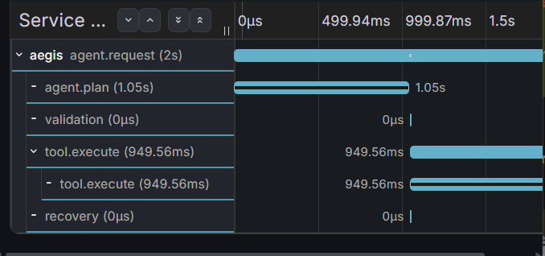

# Aegis

**A reliability runtime for LLM tool-calling agents.**

Aegis sits between an LLM's intent and the tools it tries to call. It validates execution plans before they run, checks results after they return, records exactly what happened, and recovers when execution fails.

The core belief behind Aegis: **LLMs will make mistakes. Your runtime should not.**

Aegis is intentionally **model-agnostic and framework-agnostic**. The LLM
proposes an execution plan; Aegis decides whether that plan satisfies the
runtime's contracts before allowing execution. This makes the Brain replaceable
while keeping reliability, recovery, evaluation, and observability outside the
model itself.

> **The LLM proposes what it wants to do. The runtime decides what is allowed
> to execute.**

> Aegis was originally evaluated with Llama 3.3 70B and subsequently migrated to **GPT-OSS 120B** following provider deprecation.

> The same runtime and evaluation harness were retained to measure behavioral differences across Brain implementations.

---

## Table of Contents

- [Why Aegis Exists](#why-aegis-exists)
- [Design Motivation & Prior Art](#design-motivation--prior-art)
- [The Problem with Naive Tool Calling](#the-problem-with-naive-tool-calling)
- [Architecture](#architecture)
- [What Aegis Actually Does](#what-aegis-actually-does)
- [Project Structure](#project-structure)
- [Quickstart](#quickstart)
- [Reliability Pipeline](#reliability-pipeline)
- [Evaluation](#evaluation)
- [Model Comparison](#model-comparison)
- [Observability](#observability)
- [Known Limitations](#known-limitations)
- [Local Development](#local-development)
- [Deployment](#deployment)

---

## Why Aegis Exists

Most LLM tool-calling demos stop at "it called the right tool." They show a happy path: user asks for weather, agent picks the weather tool, result comes back.

Production is different.

The LLM picks the wrong operation. The API returns malformed data. The tool works but gives a nonsense answer. The request asks for something the tool can't do. These failures are silent — the agent looks successful while returning wrong results.

Aegis exists to make those failures visible, preventable, and recoverable.

---


## Design Motivation & Prior Art

Aegis was not designed as "another agent framework." The project grew from a
specific systems question:

> **What happens between an LLM deciding what to do and a production system
> actually allowing that decision to execute?**

Several engineering articles directly shaped the design.

### 1. Anthropic :  *Demystifying evals for AI agents*

**Why it connects to Aegis:** Anthropic describes agent evaluation in terms of
**tasks, trials, graders, transcripts/trajectories, outcomes, and evaluation
harnesses**. It also distinguishes `pass@k` from `pass^k` and recommends
starting with a small suite of roughly 20–50 tasks derived from real failures.

That maps directly to Aegis:

| Anthropic concept | Aegis implementation |
|---|---|
| Task | Evaluation case in `eval/cases.json` |
| Trial | One execution of an evaluation case |
| Grader | Deterministic `grader.py` |
| Transcript / trajectory | Aegis execution trace |
| Evaluation harness | `eval/runner.py` + `passk_runner.py` |
| `pass@k` | "Did at least one trial succeed?" |
| `pass^k` | "Did every trial succeed?" |
| Regression suite | Benchmark cases reused after changes |

The article also emphasizes a critical principle: evaluate the **outcome**,
not only whether an agent followed one exact tool-call path. That influenced
Aegis's post-execution validation and its decision to treat intermediate
events as evidence rather than automatically treating them as the final
verdict.

**Read:** [Anthropic : Demystifying evals for AI agents](https://www.anthropic.com/engineering/demystifying-evals-for-ai-agents)

### 2. LangChain : *Agent Middleware*

**Why it connects to Aegis:** LangChain's middleware model treats the agent
loop as something that can be intercepted at defined lifecycle points.
Its documented hooks include `before_agent`, `before_model`,
`wrap_model_call`, `wrap_tool_call`, `after_model`, and `after_agent`.

The important idea for Aegis was not "use LangChain." It was:

> **Reliability behavior belongs around the execution loop, rather than being
> scattered through every individual tool.**

That is reflected in Aegis's separation between:

```text
Brain
  ↓
Validation
  ↓
Executor
  ↓
Tool
  ↓
Post-validation
  ↓
Recovery
```

For example, LangChain documents middleware for retries, fallbacks, guardrails,
tool-call monitoring, dynamic tool selection, and tool error handling — the
same classes of runtime concerns that motivated Aegis's executor and recovery
layers.

Aegis deliberately implements these ideas independently so that its runtime
is not coupled to a particular agent framework.

**Read:** [LangChain : Custom middleware](https://docs.langchain.com/oss/python/langchain/middleware/custom)

**Also:** [LangChain : Middleware overview](https://docs.langchain.com/oss/python/langchain/middleware/overview)

### 3. OpenTelemetry : *AI Agent Observability*

**Why it connects to Aegis:** OpenTelemetry's work on AI-agent observability
argues that agent telemetry should provide a standardized way to understand
non-deterministic agent behavior and serve as a feedback loop for evaluation
and improvement.

That directly motivated Aegis's observability layer:

```text
Aegis execution
      ↓
OpenTelemetry spans
      ↓
Grafana Tempo
      ↓
Trace / latency / failure analysis
```

Aegis records semantic stages such as:

```text
agent.plan
validation
tool.execute
recovery
post_validation
```

The application defines **what is meaningful to observe**; OpenTelemetry
provides the standard instrumentation and export mechanism.

**Read:** [OpenTelemetry : AI Agent Observability: Evolving Standards and Best Practices](https://opentelemetry.io/blog/2025/ai-agent-observability/)

For a more recent view of GenAI telemetry, see:
[OpenTelemetry : Inside the LLM Call: GenAI Observability with OpenTelemetry](https://opentelemetry.io/blog/2026/genai-observability/)

### How these ideas became Aegis

The three sources map to three different questions:

```text
- EVALUATION : "How do we know whether the agent works?"

- RUNTIME : "Where can reliability behavior intercept the agent loop?"

- OBSERVABILITY : "How do we see what actually happened?"
```


**Aegis is therefore best understood as a reliability runtime and evaluation
harness around LLM-driven tool execution, not as another LLM or agent
framework.**


## The Problem with Naive Tool Calling

Consider a user asking:

> "What was the weather in Paris last Monday?"

A naive agent does:

```
Brain → weather.current_weather(Paris)
      → Returns today's weather
      → User believes this is Monday's weather
```

**Silent failure.** The agent looks successful, but the answer is wrong.

Aegis does:

```
Brain → weather.historical_weather(Paris)
      → Validator: "weather tool only supports current_weather"
      → Recovery: Fall back to search for historical Paris weather
      → User gets relevant results
```

**Detected, prevented, recovered.** That's the difference.

---
## Architecture

### 1. Aegis Reliability Runtime


Aegis sits between the LLM's proposed execution plan and the actual tool
execution. It validates the plan before execution, verifies the result after
execution, and invokes recovery when necessary.

### 2. Execution & Recovery


Failures are classified before retrying. Fatal failures terminate early,
while retryable failures may be retried with bounded attempts and backoff.

### 3. Observability


Aegis is instrumented with OpenTelemetry. Each execution produces spans
covering planning, validation, execution and recovery. Traces are exported
to Grafana Tempo for inspection and latency analysis.

### 4. Evaluation


The evaluation harness runs identical tasks against a baseline agent and
Aegis, then compares success, consistency, failure categories and latency.
> "In a five-case stress suite, Aegis did not improve raw task success (80% vs 80%). What changed was the execution behavior: unsupported capabilities were detected before tool execution, invalid inputs were classified explicitly, and successful fallbacks became observable through structured traces."

> I initially expected the reliability layer itself to become a performance bottleneck. I instrumented Aegis with OpenTelemetry and looked at the execution traces. Across five initial runs, validation consistently took less than 1 ms, while model planning ranged from 697 ms to 10.36 seconds and tool execution ranged from 482 ms to 8.23 seconds. The preliminary result was surprising: the deterministic reliability checks were not the latency problem. The expensive components were the model and external tools.
### The Three Questions Every Layer Answers

| Layer | Question |
|-------|----------|
| Pre-execution validator | "Should I allow this plan?" |
| Executor | "Can I run this reliably?" |
| Post-execution validator | "Did it actually fulfill the plan?" |

Each layer has exactly one job. Each layer is deterministic.

---

## What Aegis Actually Does

### 9 Pre-Execution Checks

| # | Check | What It Catches |
|---|-------|-----------------|
| 1 | Model guard | LLM gave up (confidence < 0.2 + defaulted to search) |
| 2 | Tool existence | LLM hallucinated a tool name |
| 3 | Operation support | Weather doesn't do forecasts |
| 4 | Capability match | GitHub doesn't return READMEs |
| 5 | Required arguments | Missing city |
| 6 | Argument contract | Multi-city string when only one is supported |
| 7 | Argument types | `city=12345` instead of a string |
| 8 | Plausibility | "New York and London" as one city |
| 9 | Confidence threshold | Below 0.3 → abstain |

### 3 Post-Execution Checks

| Check | Question | Example Failure |
|-------|----------|-----------------|
| Integrity | Is the response structurally valid? | Missing `temperature` field |
| Plausibility | Do the values make sense? | Temperature = 9999°C |
| Completeness | Did execution fulfill the plan? | Requested Delhi + Tokyo, got only Delhi |

### Recovery Strategies

| Failure Type | Aegis Behavior |
|-------------|----------------|
| Capability mismatch | Skip retry → fallback to search |
| Low confidence | Abstain → ask user to clarify |
| Other validation failure | Retry once with error feedback |
| Execution failure | `needs_clarification` — don't retry blindly |
| API timeout/rate limit | Executor retry with backoff |

---

## Quickstart

### Local

```bash
pip install -r requirements.txt
uvicorn app:app --reload
```

Then:

```bash
curl -X POST http://localhost:8000/execute \
  -H "Content-Type: application/json" \
  -d '{"query": "What is the weather in Delhi?"}'
```

### Docker

```bash
docker build -t aegis .
docker run -p 8000:8000 --env-file .env aegis
```

### Live Demo

```
https://aegis-68nx.onrender.com/docs
```

`POST /execute` — run any query through Aegis
`GET /health` — health check

---

## Reliability Pipeline

### Happy Path

```
User: "What's the weather in Delhi?"
  ↓
Brain: weather.current_weather(city="Delhi")
  ↓
Pre-check: ✅ All 9 checks pass
  ↓
Executor: API returns Delhi weather
  ↓
Post-check: ✅ Integrity ✓ Plausibility ✓ Completeness ✓
  ↓
Response: Success
```

### Failure + Recovery

```
User: "Will it rain in Tokyo tomorrow?"
  ↓
Brain: weather.weather_forecast(city="Tokyo")
  ↓
Pre-check: ❌ Operation mismatch — weather only supports current_weather
  ↓
Recovery: Fall back to search
  ↓
Search: Returns Tokyo weather forecast
  ↓
Post-check: ✅ All checks pass
  ↓
Response: Success (via recovery)
```

### Fatal Error (No Wasted Retry)

```
User: "Weather in XYZ123"
  ↓
Brain: weather.current_weather(city="XYZ123")
  ↓
Pre-check: ✅ Passes (valid string format)
  ↓
Executor: API returns "City not found" — ValueError
  ↓
Classification: Fatal error — don't retry (retrying won't help)
  ↓
Response: needs_clarification
```

---

## Evaluation

Aegis includes a full evaluation harness with deterministic grading.

The evaluation design follows the practical principle of starting small with
failure-driven tasks rather than trying to manufacture a huge benchmark. The
current suite contains targeted capability, routing, argument, plausibility,
degradation, and edge cases, plus a stochastic suite for consistency.

This distinction matters: **runtime validation protects an individual
execution; evaluation measures whether the runtime continues to work as
intended across many executions.**


### Baseline Comparison (22-task benchmark)

| Metric | Baseline | Aegis |
|--------|----------|-------|
| Pass rate | 20% | 50% |
| Silent failures | Multiple | 0 |
| Crashes | Variable | 0% |
| Recovery | None | Yes |

The baseline is the same LLM router but with **no validation, no retry, no fallback, no post-checking**  what most demos build.

### Stochastic Evaluation (5 tasks × 5 trials = 25 trials each)

| Metric | Baseline | Aegis |
|--------|----------|-------|
| Pass@5 | 0% | 100% |
| Pass^5 | 0% | 80% |
| Silent failures | Present | 0 |
| Consistency improvement | — | +4 tasks |

Aegis succeeded in **24/25 trials**. The single failure was an upstream LLM-provider rate limit , classified as an external dependency failure, not an Aegis bug.

### What Pass@k vs Pass^k Means

| Metric | Question |
|--------|----------|
| Pass@k | Did it succeed at least once? (capability) |
| Pass^k | Did it succeed every time? (consistency) |

For a **reliability** runtime, Pass^k is the metric that matters.

---

## Model Comparison

The same Aegis pipeline was tested with different LLM providers for the Brain:

| Model | Correct Tool Selection | Avg Confidence | Usable? |
|-------|----------------------|----------------|---------|
| `llama-3.3-70b-versatile` | High | 0.9 | ✅ Yes |
| `openai/gpt-oss-20b` | Medium | 0.5-0.9 | ⚠️ Partial |
| `qwen-3.6-27b` | None | 0.1 | ❌ No |

**Key insight:** Aegis amplifies good models but cannot fix broken ones. If the Brain defaults to `search` with 0.1 confidence for every query, no validation layer can recover intent that was never captured.

---

## Observability

Aegis uses **OpenTelemetry** with **Grafana Cloud** for tracing.

Every execution produces a trace:



This shows:
- Where time is spent (planning vs execution vs validation)
- What the Brain decided
- Whether validation passed
- Whether retries happened
- Whether recovery was triggered

### Why OpenTelemetry and Not Custom JSON?

OpenTelemetry is the industry standard. It handles trace IDs, parent-child relationships, timing, and export to any backend. Aegis defines **what** to instrument (planning, validation, tool execution, recovery, post-validation); OTel handles **how** to record and export it.

---

## Scope : What Aegis Is , and Is Not

Aegis is **not**:

- a replacement for the underlying LLM
- an attempt to make a weak model reason better
- a general-purpose agent framework
- a guarantee that every external API or model provider will be available
- a benchmark claiming universal reliability across all models

Aegis is a **runtime boundary** around model-generated tool plans. Its job is
to detect unsupported or malformed plans, enforce deterministic contracts,
execute tools with controlled recovery, verify returned results, and produce
evidence that can be evaluated and observed.

This distinction is important as frontier models improve: better models can
reduce planning errors, while the runtime still provides deterministic
execution boundaries, contracts, recovery policy, and operational evidence.

---

## Known Limitations

- **No circuit breaker** : Aegis doesn't track failure rates and stop calling failing tools
- **Single-process** : No distributed execution yet
- **Keyword-based plausibility** : Heuristic, not embedding-based semantic checking
- **No authorization layer** : Tools don't have permission policies yet
- **Model-dependent** : A weak Brain produces weak plans that even Aegis can't recover

---

## Local Development

```bash
# Clone
git clone https://github.com/your-username/aegis.git
cd aegis

# Virtual environment
python -m venv .venv
source .venv/bin/activate  # or .venv\Scripts\activate on Windows

# Install
pip install -r requirements.txt

# Set up environment
cp .env.example .env
# Add your API keys

# Run
uvicorn app:app --reload
```

---

## From Prototype to Production-Oriented Runtime

Aegis was built incrementally rather than designed as a large framework up
front:

```text
Simple tool execution
        ↓
Deterministic validation
        ↓
Failure classification + retries
        ↓
Recovery / fallback
        ↓
Post-execution validation
        ↓
Evaluation harness
        ↓
Pass@K / Pass^K
        ↓
OpenTelemetry
        ↓
Grafana Tempo
        ↓
FastAPI
        ↓
Docker
        ↓
Deployed service
```

Each layer was added to address a concrete failure mode discovered while
testing the previous version. The result is intentionally smaller than a
full agent platform, but demonstrates the core production concerns around
LLM-driven tool execution: **correctness, reliability, evaluation,
observability, and deployment**.

---

## Deployment

Aegis is deployed on Render:

```
https://aegis-68nx.onrender.com
```

### Environment Variables

| Variable | Purpose |
|----------|---------|
| `GROQ_API_KEY` | LLM provider |
| `OPENWEATHER_API_KEY` | Weather tool |
| `GITHUB_TOKEN` | GitHub tool |
| `SERPAPI_KEY` | Search tool |
| `GRAFANA_INSTANCE_ID` | Tracing backend |
| `GRAFANA_API_TOKEN` | Tracing auth |
| `OTEL_EXPORTER_OTLP_ENDPOINT` | OTLP endpoint |

---

## Known Bugs Fixed

### Failure Classifier Returned "capability_mismatch" After Successful Recovery

**Symptom:** Capability test cases failed grading even though the system recovered successfully.

**Root Cause:** The classifier checked trace events in order and returned `"capability_mismatch"` as soon as it saw a rejection event , without checking if the system later recovered.

**Fix:** Moved `final_status == "success"` check to the top of the classifier.

**Lesson:** The final outcome is the source of truth. Intermediate events like `capability_rejected` are signals, not verdicts.
---

## The Bigger Picture

Aegis answers a question every production AI team eventually faces:

> **"The LLM called the right tool, but did it actually fulfill the user's request?"**

Most demos ignore this question. Aegis makes it the core of the system.

The result is not just "an agent that calls tools." It's an **execution runtime that validates decisions, verifies outcomes, records evidence, and recovers when things go wrong** , the foundation every LLM application needs before it can be trusted in production.